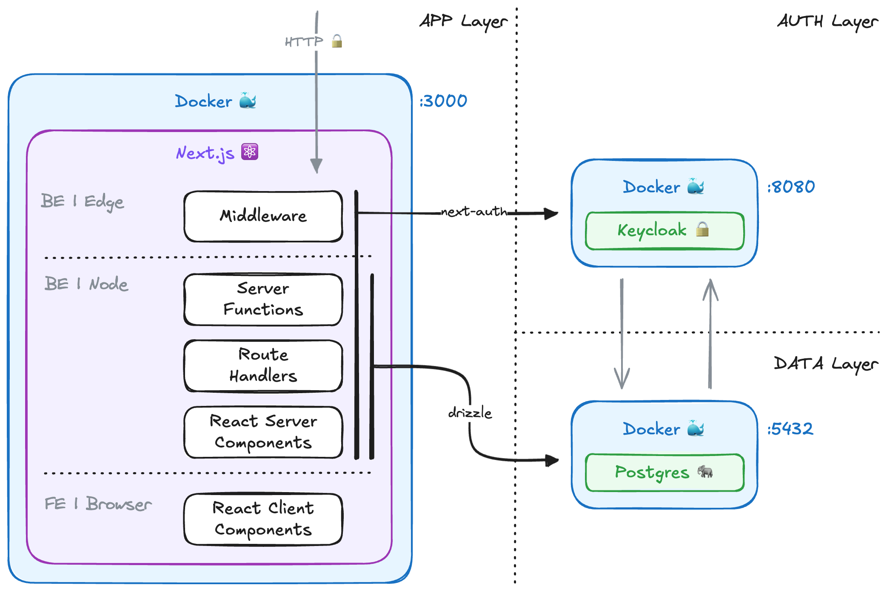
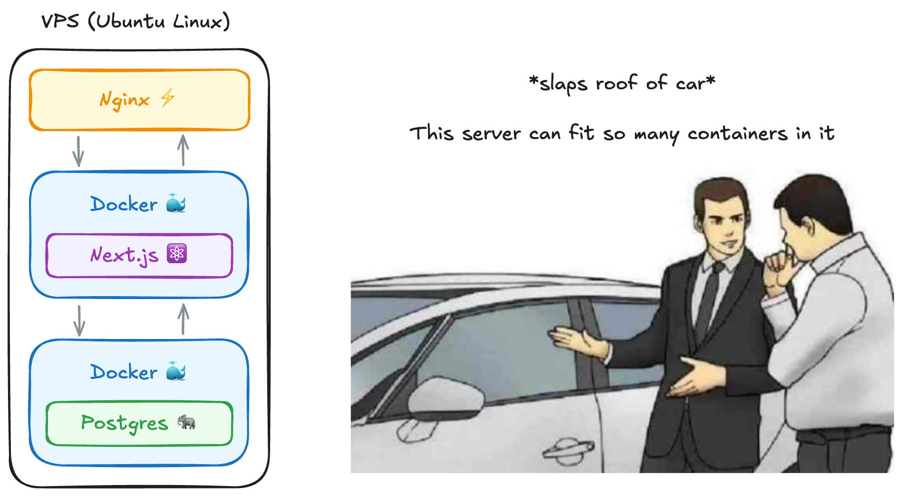

# Acme App

This is template for GELLIFY fullstack app. A [T3 Stack](https://create.t3.gg/) project bootstrapped with `create-t3-app` and configured to use the best integrations for our standard projects.

## What's next? How do I make an app with this?

We try to keep this project as simple as possible, so you can start with just the scaffolding we set up for you, and add additional things later when they become necessary.

If you are not familiar with the different technologies used in this project, please refer to the respective docs. If you still are in the wind, please refer to the [Documentation](https://create.t3.gg/) and the [T3 Stack Tutorial](https://create.t3.gg/en/faq#what-learning-resources-are-currently-available).

- [Next.js](https://nextjs.org)
- [NextAuth.js](https://next-auth.js.org)
- [Drizzle](https://orm.drizzle.team)
- [Tailwind CSS](https://tailwindcss.com)
- [Shadcn/ui](https://ui.shadcn.com)

## What's the architecture of this app?

In this stack we tried to follow all of the best practices of the different components that are used to enable the various features. In order to offer some default we pre-configured the following layers:

- ✅ App Layer, a standard [Next.js](https://nextjs.org) app
- ✅ Auth Layer, a Keycloak instance wrapped with [NextAuth.js](https://next-auth.js.org)
- ✅ Data Layer, a Postgres instance managed by [Drizzle](https://orm.drizzle.team)
- 😌 That's it!

Below you can find a diagram representing an high level overview of architecture we strived to implement. This fullstack template aims to reduce complexity, increase DX and reduce dependencies overhead.



### Architecture - App Layer

The application is build following all of the latest Next.js 14 best practices and guidelines. Please refer to [Next.js](https://nextjs.org) official docs to get a better understanding of the available features.

The standard Next.js application layer features:

- [Middleware](https://nextjs.org/docs/app/building-your-application/routing/middleware) -> `middleware.ts` single point of ingress into the app
- [API Routes](https://nextjs.org/docs/app/building-your-application/routing/route-handlers) -> `/app/api/**/route.ts` REST APIs
- [Server Actions](https://nextjs.org/docs/app/building-your-application/data-fetching/server-actions-and-mutations) -> `/app/actions.ts` new way to handle data querying and mutation
- [RSC](https://nextjs.org/docs/app/building-your-application/rendering/server-components) (React Server Component) -> `/app/**/*.tsx` default or annotated with `use server`
- [RCC](https://nextjs.org/docs/app/building-your-application/rendering/client-components) (React Client Component) -> `/app/**/*.tsx` annotated with `use client`

All of the above are just the basic features of a modern Next.js application. You can and should make a deeper deep dive into the official docs to learn about other usefull features and guidelines on how to build with this stack.

### Architecture - Auth Layer

For authentication and authorization we choose Keycloak provider. In this template Auth is configured out-of-the-box with some defaults that can be modified.

- Keycloak configuration, `/keycloak/realm.json`
- Keycloak Admin, `.env`

Comunication with Keycloak is handled via [NextAuth.js](https://next-auth.js.org). This choice enbles you the Developer to change Idendity Provider is needed, without much effort. See the relative [documentation](https://next-auth.js.org/providers/) to find out more.

### Architecture - Data Layer

A standard Postrges Database is the default. Both the App and Keycloak will use the same DB (but different schemas) to handle their respective business logic.

[Drizzle](https://orm.drizzle.team) is the ORM used to manage the the DB and this is the case for several reasons:

- Can handle almost every relational databases, so switching can be done pretty easily.
- NextAuth has a Drizzle adapter to access the underling DB, giving both the _App Layer_ and the _Auth Layer_ a standard way to manage data.
- Easy way to handle schema push, migrations and seeding of the DB

**Why not Prisma?**

1. Prisma needs a generation step to be typesafe where Drizzle is 100% typescript
2. Prisma handle query under the hood, making impossible for the Developer to optimize or take control of a given query.

## How do I start developing with this?

### Requirements

- Docker or Podman
- Node Version Manager ([fnm](https://github.com/Schniz/fnm) **reccomended** to switch version automagically)

### Getting started

1. First you have to create a copy of the environment variables.

```sh
cp .env.example .env
```

2. Then start the localstack needed for development. We need a Postgres instace, a Keycloak server and we should also push DB schema + seed. All of the above can be done with a pre-configured script

```sh
./start-localstack.sh
```

3. Run the actual Next.js development server

```sh
pnpm run dev
```

### Supported Features

This demo tries to showcase many different Next.js features.

- Image Optimization
- Streaming
- Talking to a Postgres database
- Caching
- Incremental Static Regeneration
- Reading environment variables
- Using Middleware
- Running code on server startup
- A cron that hits a Route Handler

View the demo at https://acme-app.gellify.dev to see further explanations.

## How do I deploy this?



#### Prerequisites

1. ✅ Purchase a domain name
2. ✅ Purchase a Linux Ubuntu server (e.g. droplet)
3. ✅ Docker
4. 😌 That's it!

#### Quickstart

1. SSH into your server:

```sh
ssh root@your_server_ip
```

2. Create a SSH key pair:

```sh
ssh-keygen -t ed25519 -C "name.surname@gellify.com"
# Enter a file in which to save the key (/home/YOU/.ssh/id_ALGORITHM):[Press enter]
# Enter passphrase (empty for no passphrase): [Type a passphrase]
# Enter same passphrase again: [Type passphrase again]

eval "$(ssh-agent -s)"

ssh-add ~/.ssh/id_ed25519
```

3. Copy the SSH public key to clipboard and add it to your GitHub or BitBucket account:

```sh
$ cat ~/.ssh/id_ed25519.pub
# Then select and copy the contents of the id_ed25519.pub file
# displayed in the terminal to your clipboard
```

4. From your shell upload the deployment script via SSH:

```sh
scp -i ~/.ssh/id_ed25519 deploy.sh root@your_server_ip:~
```

5. From inside the server run the deployment script:

> You can modify the email and domain name variables inside of the script to use your own.

```sh
chmod +x ~/deploy.sh
./deploy.sh
```

#### Deploy script

I've included a Bash script which does the following:

- Installs all the necessary packages for your server
- Installs Docker, Docker Compose, and Nginx
- Clones this repository
- Generates an SSL certificate
- Builds your Next.js application from the Dockerfile
- Sets up Nginx and configures HTTPS and rate limting
- Sets up a cron which clears the database every 10m
- Creates a .env file with your Postgres database creds
- Once the deployment completes, your Next.js app will be available at:

http://your-provided-domain.com

Next.js app, PostgreSQL database and Keycloak instance will be up and running in Docker containers. To set up your database, you could install npm inside your Postgres container and use the Drizzle scripts.

For pushing subsequent updates, I also provided an update.sh script as an example.

## Must read and watch

- [From 0 to Production - The Modern React Tutorial (RSCs, Next.js, Shadui, Drizzle, TS and more)](https://www.youtube.com/watch?v=d5x0JCZbAJs)
- [React Hook Form & React 19 Form Actions, The Right Way](https://www.youtube.com/watch?v=VLk45JBe8L8)
- [Self-Hosting Next.js](https://www.youtube.com/watch?v=sIVL4JMqRfc)
